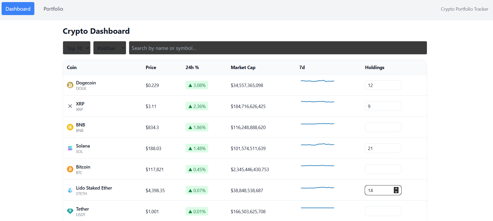
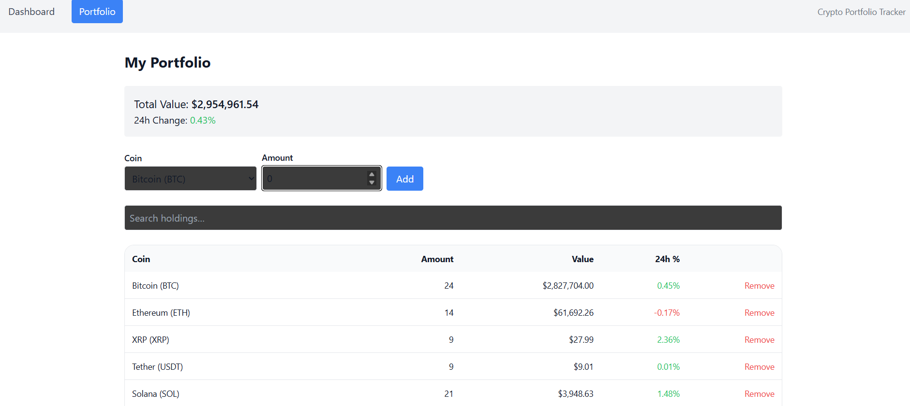

# 📊 Crypto Portfolio Dashboard

[](https://app.netlify.com/sites/crypto-portfolio-dashboard/deploys)

🚀 Live Demo: 👉 [https://crypto-portfolio-dashboard.netlify.app](https://crypto-portfolio-dashboard.netlify.app)

---

## ✨ Features

- 📈 **Dashboard** with live coin data: price, market cap, 24h % change
- 🔎 **Filters**: 
  - Search by name/symbol  
  - Show **Top 10 / Top 50 / All** coins  
  - Filter **positive/negative performers**
- 💼 **Portfolio Tracking**:
  - Add coins and holdings
  - View total value & daily change
- 🔄 **Auto-refresh prices** every 30 seconds
- 🧩 **Redux Toolkit** state management
- 💾 **Local persistence** of filters & portfolio
- ✅ **Unit tests** for Redux slices & selectors (Jest + RTL)
- 🎨 Responsive design with TailwindCSS
- ⚡ Fast builds using Vite

---

## 🛠️ Tech Stack

- [React](https://react.dev/) + [TypeScript](https://www.typescriptlang.org/)
- [Redux Toolkit](https://redux-toolkit.js.org/)
- [React Router](https://reactrouter.com/)
- [TailwindCSS](https://tailwindcss.com/)
- [Vite](https://vitejs.dev/)
- [Jest](https://jestjs.io/) + [React Testing Library](https://testing-library.com/)

---

## 📂 Project Structure

src/
├── app/ # Redux store & hooks
├── components/ # Reusable UI components
├── features/ # Redux slices (coins, filters, portfolio, ui)
├── pages/ # Dashboard & Portfolio pages
├── routes/ # AppRouter
├── middleware/ # Persistence & polling middleware
├── utils/ # Helpers & formatting
└── styles/ # Global styles

---

## 🚀 Getting Started

### 1️⃣ Clone the repo
```bash
git clone https://github.com/ksamrat083/crypto-portfolio.git
cd crypto-portfolio
```

### 2️⃣ Install dependencies
```bash
npm install
```

3️⃣ Run locally
```bash
npm run dev
```
Open http://localhost:5173

4️⃣ Run tests
```bash
npm test
```

5️⃣ Build for production
```bash
npm run build
```
Deploy the dist/ folder to Netlify or Vercel.

🔗 Deployment

This app is deployed on Netlify with automatic builds from the main branch.

➡️ Live Demo: crypto-portfolio-dashboard.netlify.app

---

## 📸 Screenshots  

### Dashboard  
  

### Portfolio  
  

---

📜 License

MIT License © 2025 @ksamrat083
